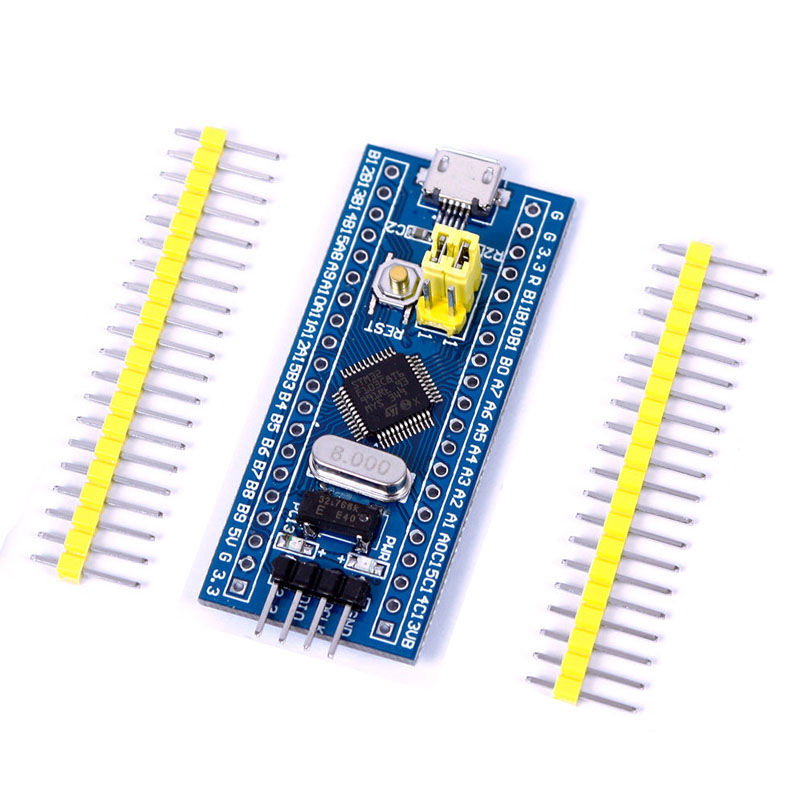
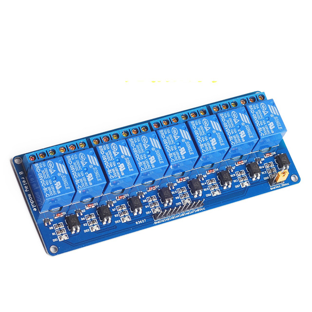
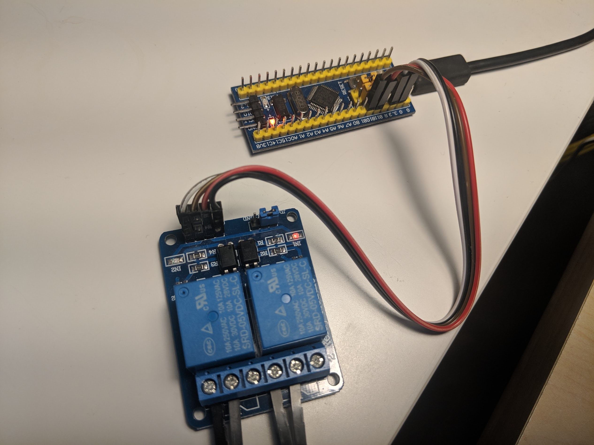

# USB Relay firmware for STM32Fx

Testing your Unicycle application at a real hardware is a great way to verify your functionality.
During the development cycle one needs to reboot the device to get into the bootloader stage and eventually load the Unicycle application itself. While it is possible to press the computer power button manually such activity is not possible to script and it slows down application reboot cycle.

To help to automate Unicycle application redeployment I created a setup based on
[STM32F103C8](https://www.st.com/en/microcontrollers-microprocessors/stm32f103c8.html) board like this one



and a USB relay:



The firmware supports 2 channels named `powerbtn` and `resetbtn` that manage power and reset buttons respectively. Once the STM32 board is connected to the development host machine you'll see a new ACM device (e.g. `/dev/ttyACM0`) that represents terminal to the board. One can trigger button press by executing following command at the host machine: `echo 'resetbtn pulse' > /dev/ttyACM0`. `pulse` in this case means toggle the button state, wait 0.1 sec and then toggle state back.

It is useful to have an alias like `alias rebuild="shog && echo 'resetbtn pulse' > /dev/ttyACM0"`

The firmware uses [librfn](https://github.com/daniel-thompson/librfn) library.

## Build
To build firmware please install `arm-none-eabi` toolchain and `libopencm3` package. At Arch Linux they are represented by `arm-none-eabi-gcc` and `libopencm3-git` packages respectively.

The run build command itself: `./build.rb`. You'll get `relay.bin` file ready to flash to your STM32Fxx board.

## Flash firmware to the board
To flash firmware to SMT32Fx board connect [ST-Link V2 programmer](https://www.amazon.com/Aideepen-ST-Link-Programming-Emulator-Downloader/dp/B01J7N3RE6) to the board and run
`st-flash write relay.bin 0x8000000`

## Using the relay
The firmware uses following two GPIO's to manage relay: B10 - reset button, B11 - power button. To manage the motherboard buttons one needs to connect the gpios to relay:

|STM32F1|Relay|
| ---- | --- |
|G|GND|
|3.3|VCC|
|B10|IN1|
|B11|IN2|

Then connect relays' contact pairs to botherboard button connectors. Like this



Connect STM32 USB to your host and `lsusb` will show a new device
```
Bus 001 Device 010: ID 6666:9637 Prototype product Vendor ID
```
that will be represented by `/dev/ttyACM0` device file.

`echo 'led on' > /dev/ttyACM0` turns on the board's LED. `echo 'powerbtn pulse' > /dev/ttyACM0`
 triggers the motherboard powerup.
